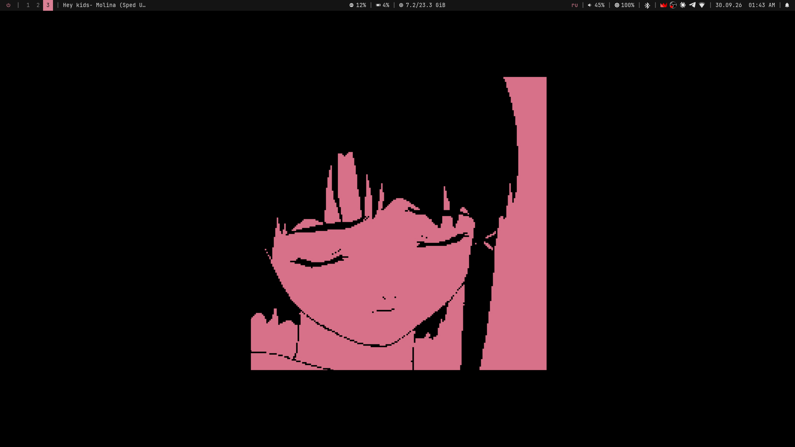
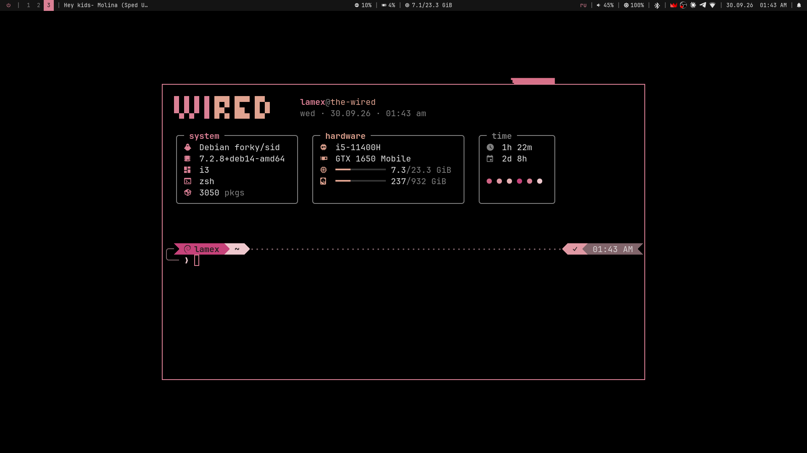
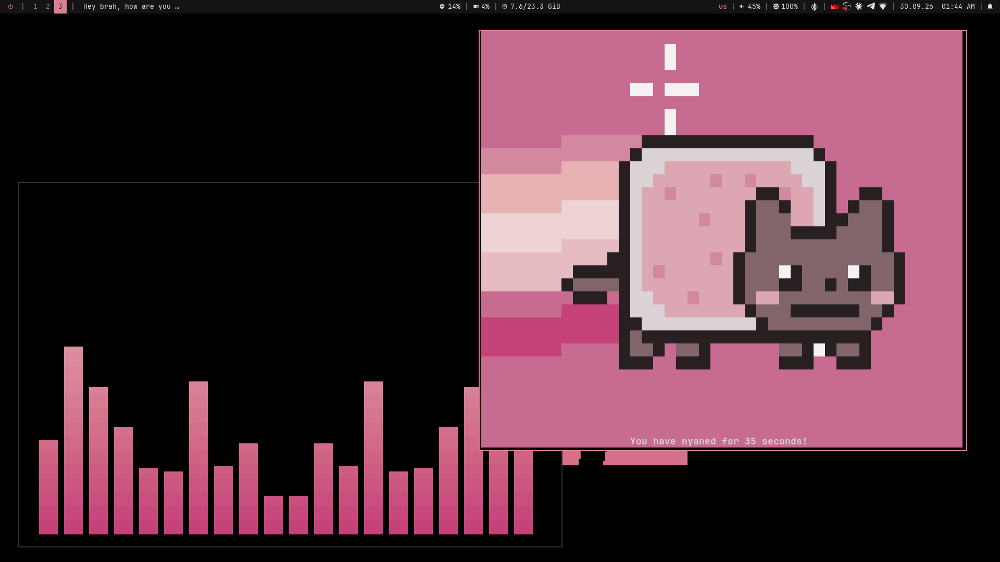
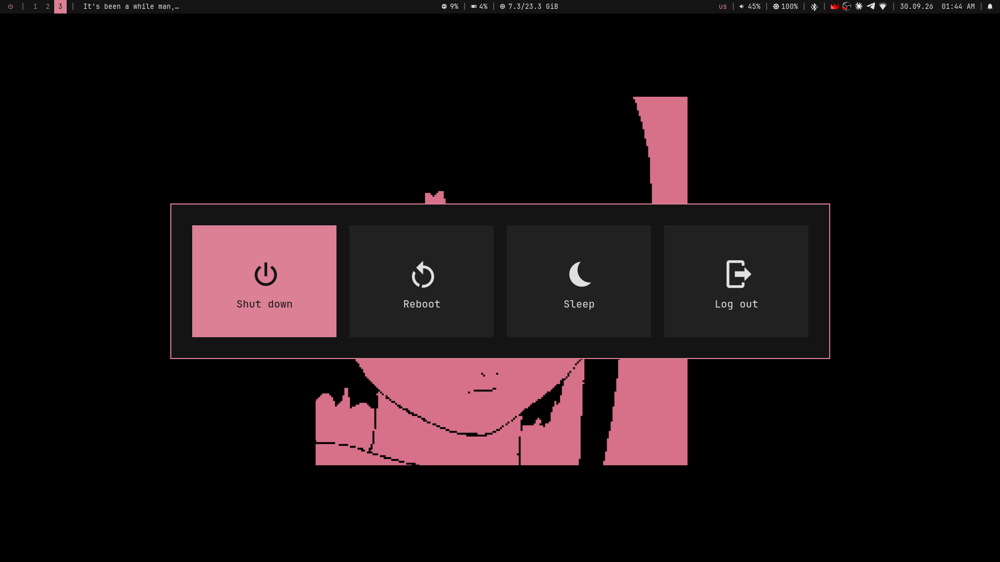

# wired

i3 rice for Debian where **the whole system is colored by the wallpaper**: panel, window borders,
launcher, notifications, popups, terminal palette, cava, fetch, folder icons, lock screen,
KDE/Qt apps. Change the wallpaper (Meta+W) and everything re-themes itself.






## Details

| | |
|---|---|
| **WM** | i3 + Hyprland-style dwindle tiling (`autotiling.py`) |
| **Bar** | polybar |
| **Launcher / menus** | rofi |
| **Notifications** | dunst (+ custom notification sound) |
| **Terminal** | alacritty |
| **Fetch** | `wired-fetch` (fastfetch data, own layout) |
| **Font** | JetBrainsMono Nerd Font |
| **Icons** | Papirus-Dark, folders recolored from the wallpaper |
| **Cursor** | Bibata Original Classic |
| **GTK theme** | Adwaita-dark |
| **Lock** | i3lock-color (falls back to i3lock) |

## What's inside

- **Wallpaper-driven theme**: `i3/scripts/theme.py` extracts a palette from the wallpaper and writes
  colors for i3, polybar, rofi, dunst, alacritty (black background, accent gradient), cava, fastfetch,
  kdeglobals, the lock screen and Papirus folder icons.
- **Wallpaper picker** (Meta+W or the bar button): thumbnail grid of a folder, remembers the folder.
- **Popups** that close when the pointer leaves: audio (output/input device + volume, per-app volume),
  battery + brightness, bluetooth, notification center with Do Not Disturb.
- **OSD** under the bar for volume, brightness, keyboard layout, Caps Lock and clipboard copies.
- **Power menu** grid, **clipboard history** at the cursor, **magnifier** (Meta+Ctrl+scroll),
  **region screenshot** with dimmed surroundings, **KDE-style resize** (Meta+right drag, 3x3 zones),
  **idle manager** (dim → lock → screen off, paused while media plays).

## Install

```sh
git clone https://github.com/lamex30/dotfiles && cd dotfiles
./install.sh               # add --lock-color to build i3lock-color
```

The installer checks every package with apt before installing and lists the ones it couldn't find,
backs up your existing configs to `~/.config/dotfiles-backup-*`, downloads the fonts and cursor,
and generates the colors from the included wallpaper.

## Keybinds

| Keys | Action |
|---|---|
| Meta+Return | terminal |
| Meta+Space | app launcher |
| Meta+V | clipboard history |
| Meta+W | wallpaper picker |
| Meta+E / Meta+Alt+E | Dolphin / yazi |
| Meta+Q | close window |
| Meta+H/J/K/(→) · arrows | focus |
| Meta+Shift+H/J/K/L · arrows | move window |
| Meta+Ctrl+H/J/K/L | resize |
| Meta+F / F11 | float / fullscreen |
| Meta+T / M / R | default / tabbed / rotate split |
| Meta+1…0 · Meta+F1…F10 | workspace · move window there |
| Meta+Shift+S · Meta+Ctrl+S · Meta+Print | region · full · window screenshot |
| Meta+Alt+S | full screenshot in 3 s |
| Meta+Ctrl+scroll · Meta+Ctrl+0 | magnifier · reset |
| Meta+L · Meta+Esc | lock + screen off · screen off |
| Meta+right drag | resize by edge |
| Caps Lock · Shift+Caps | switch layout (us/ru) · Caps Lock |
| Meta+Ctrl+R · Meta+Shift+E | restart i3 · exit |

## Credits

[i3](https://i3wm.org) · [polybar](https://github.com/polybar/polybar) · [rofi](https://github.com/davatorium/rofi) ·
[dunst](https://github.com/dunst-project/dunst) · [fastfetch](https://github.com/fastfetch-cli/fastfetch) ·
[Nerd Fonts](https://www.nerdfonts.com) · [Bibata Cursor](https://github.com/ful1e5/Bibata_Cursor) ·
[i3lock-color](https://github.com/Raymo111/i3lock-color) · [Papirus](https://github.com/PapirusDevelopmentTeam/papirus-icon-theme)
